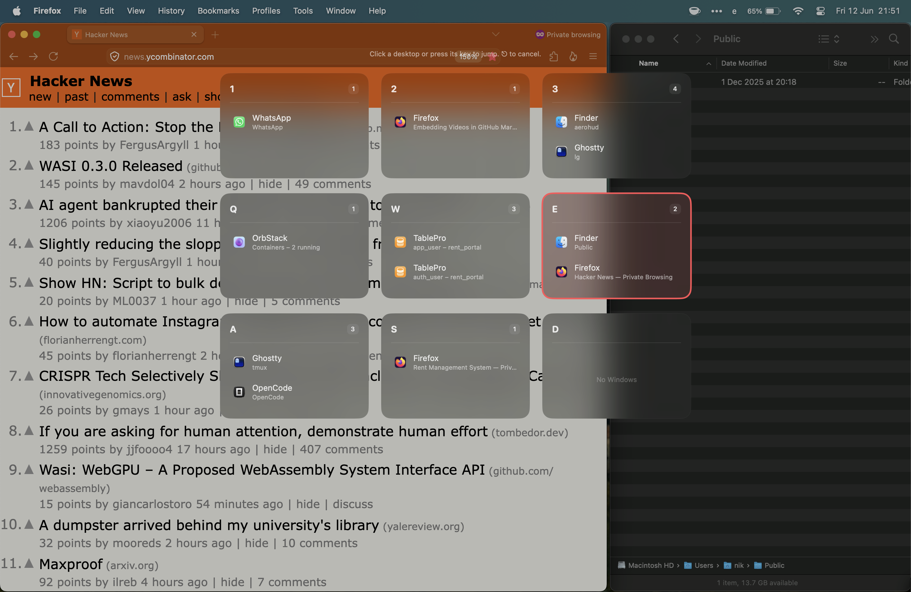

# AeroHUD

Native macOS SwiftUI grid overview for [AeroSpace](https://github.com/nikitabobko/AeroSpace/).



This was designed for my own estoeric workflow, where I have nine desktops in 3x3 grid.

This app helps me recall which window was where, and quickly switch desktops.

### Install

For arm64 Macs (macOS 11+), download the binary from [Releases](https://github.com/nikhilmwarrier/aerohud/releases) to `~/.local/bin/`.  

Otherwise see [build instructions ](#build) below.

### Configuration

Add this directive to `~/.aerospace.toml`:
```toml
[mode.main.binding]
# Modify according to your layout
alt-space = 'exec-and-forget ~/.local/bin/aerohud 3 1 2 3 q w e a s d'
```

### Usage

```bash
aerohud <COLS> <workspaces...>
```

### Examples

```
┌────┬────┬────┐
│  1 │  2 │  3 │
├────┼────┼────┤
│  q │  w │  e │
├────┼────┼────┤
│  a │  s │  d │
└────┴────┴────┘
```
```bash
# Three cols, workspaces 1 2 3, q w e, a s d
aerohud 3 1 2 3 q w e a s d
```

Similarly,
```
┌────┬────┬────┬────┐
│  1 │  2 │  3 │  4 │
├────┼────┼────┼────┤
│  q │  w │  e │  r │
└────┴────┴────┴────┘
```
```bash
# Four cols, workspaces 1 2 3 4, q w e r
aerohud 4 1 2 3 4 q w e r
```


## Build

```bash
git clone https://github.com/nikhilmwarrier/aerohud.git
cd aerohud
just build # or open justfile and run the commands from there
just copy
```
